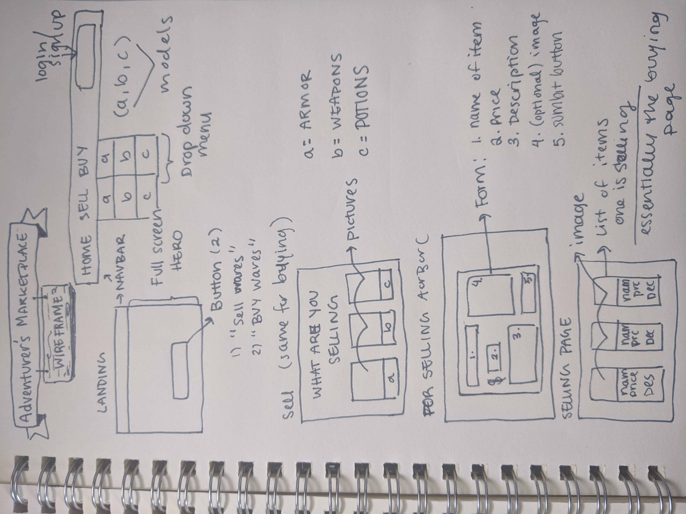

# Capstone Proposal - Adventurer's Marketplace
# Mission statement
Adventurer's Marketplace is a gag-site for Adventurers to sell or buy their wares - armor, weapons, potions. 
# MVP
The user will be able to create a selling post (optional image, description, name of the item, and price), view/read a the list of their selling items and delete an item they're selling. They'll be able to sell: armor, weapons, potions.
## Java models
- armor
- weapons
- potions

# Wireframe of your application

# Libraries (if applicable)
TBD

# Post MVP
- Create the buy page
- Maybe a shopping cart

# Projected Schedule
TBD